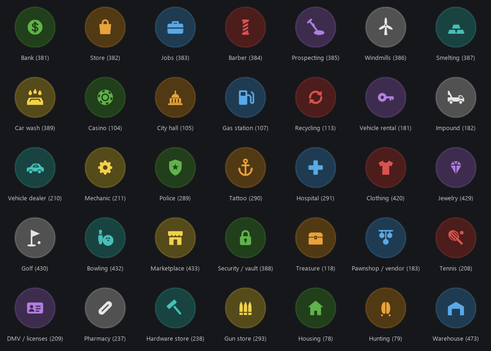

New map blip icons for FiveM, plus an in-game editor for placing blips without touching code.

<<<<<<< Updated upstream
- **35 custom icons**: bank, stores, hospital, police, garages, jobs, casino, housing and more. They are drawn as one set: round badge, solid glyph.
=======


- **50 replaceable blip slots. Drop in a PNG, restart, done.** No build tools and no texture editing. `blips/381.png` becomes the icon for sprite `381`.
- **35 icons included**: bank, stores, hospital, police, garages, jobs, casino, housing and more, drawn as one set (round badge, solid glyph). 15 slots are left free for your own.
>>>>>>> Stashed changes
- **Works with every script you already have.** Each icon replaces a vanilla blip sprite id. Any resource that calls `SetBlipSprite(blip, 381)` shows the new bank icon, with no changes to that resource.
- **`/blips` editor** to create, move, edit, teleport to and delete blips in game. Blips are saved in MySQL and pushed to every player instantly.
- Icons, radius circles and area rectangles, with colour, scale, opacity, tick and outline.
- Standalone. It only needs `ox_lib` and `oxmysql`, with no framework required. It uses the same `global_blips` table as `blips_creator`, so your old blips carry over.

## Requirements

- [ox_lib](https://github.com/overextended/ox_lib)
- [oxmysql](https://github.com/overextended/oxmysql)

## Installation

1. Download the repository and put the folder in your `resources` as `p-custom-blips`.
2. Add it to `server.cfg` after its dependencies:
   ```cfg
   ensure ox_lib
   ensure oxmysql
   ensure p-custom-blips
   ```
3. Start the server. The `global_blips` table is created automatically.

If you used `blips_creator` before, stop it. Both read the same table, so your blips show up here.

## Adding your own icons

1. Make a square PNG with a transparent background (64×64 or larger; it is scaled down to fit).
2. Name it after the sprite id of a slot (see [Slots](#slots)) and put it in `blips/`, for example `blips/431.png`.
3. Restart the resource (`ensure p-custom-blips`). Players see it after they reconnect or the resource restarts.

To replace one of the included icons, overwrite its PNG. To get a vanilla icon back, delete the PNG. Optionally rename the slot's `label` in `config.lua`; that label appears in the `/blips` dropdown.

For icons that tint nicely, draw them **light grey/white on transparent**: see [Colours](#colours).

## How it works

GTA V does not draw blips from separate image files. All blip icons sit side by side on a few large textures (the *blip texture sheets*) inside the game's `minimap.ytd`. A sprite id such as `381` is just a 64×64 square on one of those sheets.

When a player loads in, `client.lua`:

1. Checks which slots have a PNG in `blips/`.
2. Opens a hidden in-game browser page (`html/sheet.html`, a DUI). The page draws the vanilla sheet (`sheets/blips_texturesheet_ng.png`) and paints every dropped-in PNG over its slot.
3. Uses that page as the replacement for the game's sheet:

```lua
local txd = CreateRuntimeTxd('p_custom_blips')
CreateRuntimeTextureFromDuiHandle(txd, 'blips_texturesheet_ng', GetDuiHandle(dui))
AddReplaceTexture('minimap', 'blips_texturesheet_ng', 'p_custom_blips', 'blips_texturesheet_ng')
```

From then on, every blip that uses one of those sprite ids draws your icon, on the minimap and the pause map. Nothing is streamed and nothing has to be rebuilt. Stopping the resource puts the original sheet back.

### Colours

GTA multiplies a blip's image by its blip colour (`SetBlipColour`). The icons are drawn for that:

- **Grey badge.** It turns into a dark shade of the blip colour.
- **White glyph.** It turns into the full blip colour.

So one icon works in any colour. Bright colours (green `2`, light blue `3`, yellow `5`, orange `17`, light red `6` and so on) give the best contrast. Very dark colours make the badge almost black. Colour ids: [docs.fivem.net/docs/game-references/blips](https://docs.fivem.net/docs/game-references/blips/#blip-colors).

## Slots

These 50 sprite ids can be replaced. They are all on the same sheet and were picked because they belong to story/mission blips that roleplay servers rarely use. Use the **sprite id** in any script, or pick the icon from the *Custom icon* dropdown in `/blips` (it lists only slots that have a PNG).

**Included icons (35):**

| Sprite | Icon | Sprite | Icon | Sprite | Icon |
|---|---|---|---|---|---|
| 381 | Bank | 107 | Gas station | 429 | Jewelry |
| 382 | Store | 113 | Recycling | 430 | Golf |
| 383 | Jobs | 181 | Vehicle rental | 432 | Bowling |
| 384 | Barber | 182 | Impound | 433 | Marketplace |
| 385 | Prospecting | 210 | Vehicle dealer | 388 | Security / vault |
| 386 | Windmills | 211 | Mechanic | 118 | Treasure |
| 387 | Smelting | 289 | Police | 183 | Pawnshop / vendor |
| 389 | Car wash | 290 | Tattoo | 208 | Tennis |
| 104 | Casino | 291 | Hospital | 209 | DMV / licenses |
| 105 | City hall | 420 | Clothing | 237 | Pharmacy |
| 238 | Hardware store | 293 | Gun store | 78 | Housing |
| 79 | Hunting | 473 | Warehouse | | |

**Free slots (15):** `431` `434` `400` `405` `495` `76` `77` `89` `120` `352` `355` `205` `206` `269` `149`

Each included icon is in `blips/` as a 128×128 PNG. A slot's position on the sheet is in `Config.Slots`; you never need to change it.

### Using the icons in your own scripts

Use the sprite id the same way as any vanilla blip:

```lua
local blip = AddBlipForCoord(-1212.7, -330.8, 37.8)
SetBlipSprite(blip, 381)   -- custom Bank icon
SetBlipColour(blip, 2)     -- green
SetBlipScale(blip, 1.0)
SetBlipAsShortRange(blip, true)
BeginTextCommandSetBlipName('STRING')
AddTextComponentString('Bank')
EndTextCommandSetBlipName(blip)
```

Most shop, job and garage scripts have a `sprite` value in their config. Set it to the id from the table.

## The `/blips` editor

`/blips` is for admins. By default that's anyone in `group.admin`; see [Permissions](#permissions).

- **Create blip here**: adds a blip at your position.
- Pick an existing blip to **Edit**, **Move here**, **Set waypoint**, **Teleport** to it or **Delete** it.

Fields in the editor:

| Field | Meaning |
|---|---|
| Name | Label shown on the pause map. |
| Type | `Icon`, `Radius (circle)` or `Area (rectangle)`. |
| Sprite id | Any vanilla sprite id. |
| Custom icon | One of the slots that has a PNG. It overrides the sprite id. |
| Colour | Blip colour id (0–85). |
| Scale / Opacity | Size and transparency. |
| Display | Map + minimap, map only or minimap only. |
| Tick / Outline | Extra blip indicators. |
| Width / Height | Size of radius and area blips, in metres. |

Changes are saved to the database and sent to every online player at once.

**Personal blips:** a row in `global_blips` with a player license in the `identifier` column is only shown to that player. You can use this from other scripts by inserting rows directly.

## Configuration

Everything is in `config.lua`:

| Option | Default | |
|---|---|---|
| `Config.blipsShow` | `true` | Turns all blips from this resource on or off. |
| `Config.shortRange` | `true` | Database blips only show on the minimap when nearby (always on the pause map). |
| `Config.commandGroup` | `'group.admin'` | ACE group allowed to use `/blips`. |
| `Config.Locations` | `{}` | Static blips defined in code instead of the editor. |
| `Config.Slots` | 50 slots | Replaceable sprite ids, their place on the sheet and their dropdown label. |
| `Config.sheet` | `blips_texturesheet_ng`, 1024×1024 | The vanilla sheet in `sheets/` the slots are painted onto. |

Static blip example:

```lua
Config.Locations = {
    { coords = vec3(750.27, -1298.06, 36.16), sprite = 432, scale = 1.0, color = 50, label = 'Bowling' },
}
```

## Permissions

`lib.addCommand` gives the ACE `command.blips` to `Config.commandGroup`. The server checks the same ACE before saving or deleting anything, so a modified client cannot edit blips. To let another group use the editor:

```cfg
add_ace group.mod command.blips allow
```

## Notes and limits

- **Only the 50 slots can be changed.** Each icon replaces an existing vanilla one. More slots could be added from the same sheet, but some vanilla blips are drawn from vector shapes instead of a texture and cannot be replaced at all.
- **Each player runs one small hidden browser page** to draw the sheet. It draws once at load and then stays idle.
- **Other scripts that use these sprite ids also get the new icon.** That is the point of the resource. If a script relied on the original look of, say, sprite `381`, it changes too.
- **Only one resource can replace a sheet.** If another resource (some HUD or minimap packs) replaces `blips_texturesheet_ng` too, whichever starts last wins.
- `sheets/blips_texturesheet_ng.png` is the game's own, unmodified sheet (game build 3751). Slots without a PNG keep their vanilla icon.

## License

MIT. See [LICENSE](LICENSE). The icons in `blips/` are original artwork. `sheets/blips_texturesheet_ng.png` is Rockstar Games' original blip artwork, included only so the replacement sheet stays complete.
